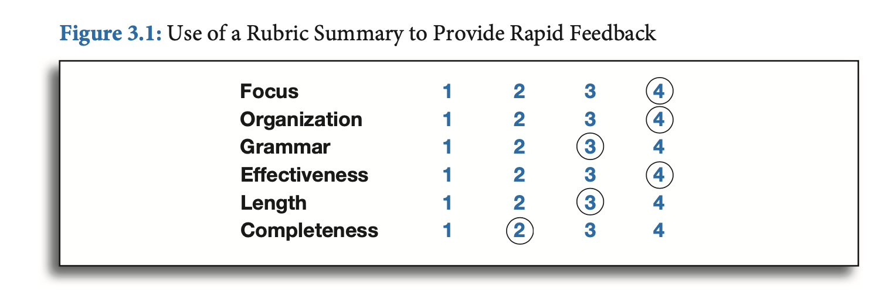

## Stratégie 1 : clarifier, partager et comprendre les intentions d'apprentissage

Questions à se poser (selon Tyler, 1949):

1. Quel est l'objectif éducatif?
2. Quelles expériences éducatives permettent d'atteindre l'objectif?
3. Comment organiser efficacement les expériences?
4. Comment déterminer si l'objectif a été atteint?

- Il n'est pas obligatoire de citer les "learning intentions" au début de chaque cours.
- Parfois l'activité pédagogique n'est pas dirigée vers un "objectif précis" mais un horizon de possibilités. Ou centrée une expérience, une tâche propre à engendrer des apprentissage.
- Parfois, une amorce peut davantage susciter la curiosité si l'objectif final n'est pas annoncé.
- Les élèves ne sont pas toujours motivés par l'apprentissage. L'enseignant-e devrait trouver une accroche, pour rendre *vivante* la matière à enseigner.

Développer de bonnes "learning intentions" et "success criteria" est une tâche très difficile.

### Intentions et contexte

Il est important de séparer l'intention d'apprentissage, et le contexte (*context of learning*). On veut que les élèves puissent appliquer leurs acquis dans d'autres contextes.

Le transfer d'un contexte vers un autre est *très difficile* pour l'élève.

Conseils: 

- Appliquer ce qu'ils ont appris dans un autre contexte.
- "Mix it up", varier les activités d'apprentissage.

## Start with samples of work

"Start with **samples of work**, rather than rubrics, to communicate quality". "Plutôt qu'une liste de critères, commencer en montrant des **exemples de travaux**".

Avantages de cette méthode:

- Il est plus facile de critiquer le travail d'autres personnes (anonymes)
- Permet de contraster deux travaux (plutôt bon, plutôt mauvais)
- Le think-pair-share est une bonne technique pour réagir aux qualités des travaux, et développer un vocabulaire.
- Permet la construction des "success criteria".

## Rubrics

Un "Rubric" (grille de critères): 

- C'est une collection de "success criteria".  
- Devrait pouvoir s'appliquer à plusieurs types de travaux, pas une seule tâche.
- Peut prendre différentes formes.
- Ça peut être une checklist : cela permet une auto-évaluation.

Il faut s'interroger comment on nomme les niveaux de qualification :

- 1 – 2 – 3 – 4
- Below basic – Basic – Proficient – Advanced
- Novice – Apprentice – Practictioner – Expert

Exemple de "rubric" permettant un feedback rapide:

 

## Big Ideas

"The big idea" donne une vision globale pour un ensemble de leçons. Il devrait y en avoir entre 5 et 10 pour une matière.

50% à 60% du curriculum devrait être constitué de "Big Ideas" (dans l'idéal).

 
 
 