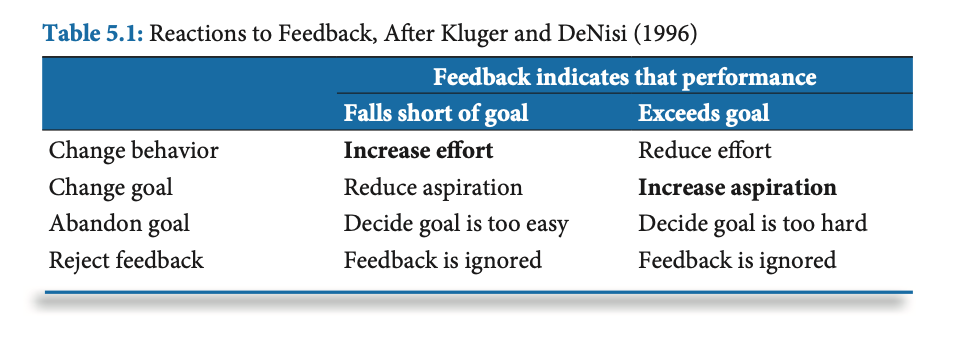

## Stratégie 3 : Feedback

Ce chapitre commence par présenter certains éléments de la recherche sur le "feedback", en particuler une étude de 1996 (Kluger & DeNisi, psychologues à l'Université de New Jersey). Dans cette étude, les chercheurs ont analysé des milliers d'articles portant sur **l'effet du feedback sur la performance**. Selon 38% des études, le résultat du feedback est *négatif*. En moyenne, le feedback amène une amélioration d'un facteur de 0.41 (cela signifie qu'un étudiant moyen verrait sa performance monter de 50% à 66%, un peu au-dessus de la moyenne).

Les chercheurs ont établi qu'un sujet peut réagir au feedback de quatre manières: changer son comportement, changer son objectif, abandonner son objectif, ou ignorer le feedback. Selon la situation - feedback positif ou négatif - il y a donc huit réactions possibles, parmi lesquelles *seules deux* sont souhaitables (en gras dans le schéma ci-dessous). Cela explique pourquoi le feedback peut si facilement devenir contre-productif!

 

Principes importants du feedback: 

- La seule chose qui compte, c'est la réaction de l'élève.
- Le feedback a un effet si l'élève l'utilise pour s'améliorer. Sinon, c'est une perte de temps.

Le facteur le plus important pour la bonne utilisation du feedback est **la relation** construite avec l'élève. C'est pourquoi il est important de connaître ses élèves, et établir un lien de confiance.

L'étude de Stone & Heen "Thanks for the feedback" (2014) décrit trois types de "triggers" qui déclenchent un rejet, et empêchent la bonne utilisation du feedback.

### Conception incrémentelle de l'intelligence

Un point important est la "conception de l'intelligence": envisager l'intelligence non comme une capacité fixe, mais incrémentelle. Une qualité dynamique et améliorable grâce aux efforts fournis, qui peut croître en travaillant sur des problèmes.

 Il est donc important d'aider les élèves à développer une conception *incrémentielle* de l'intelligence:

- Attirer leur attention sur les progrès dûs à l'effort.
- Les compliments doivent porter sur la tâche réalisée (pas l'individu)

## Modèles d'évaluation

Les auteurs comparent deux modèles d'évaluation, le *standards-based grading* qui ne tient compte que des résultats obtenus, et un modèles qui prend aussi en compte "l'effort" ou de l'attitude de l'élève. Ce modèles basé sur l'effort a trois problèmes: 

- L'élève est mieux placé que l'enseignant pour évaluer l'effort fourni (on risque de se tromper).
- L'effort est fortement corrélé au résultat, c'est une "double peine" pour les élèves en difficulté.
- Un élève peut faire un grand effort mais avec une mauvaise stratégie.

Recommandation des auteurs: comme dans le sport, évaluer les *academic personal bests*".

### Quantité de feedback à donner

Souvent, les enseignants passent deux fois plus de temps à évaluer qu'à planifier l'enseignement. Ces proportions devraient être inversées: préparer deux fois plus de temps à la préparation.

Recommandation sur la part de travail des élèves à évaluer: 

- Un quart du travail fait l'objet d'un feedback détaillé par l'enseignant.
- Un quart est brièvement passé en revue par l'enseignant.
- Un quart fait l'objet d'un "peer assessment".
- Le quart restant est auto-évalué.

*"Never work harder than your students!"* - le feedback devrait donner plus de travail **à l'élève** qu'à l'enseignant. On peut ainsi demander que les élèves réagissent au feedback. Une "fiche de feedback" ou un "carnet de feedback" (*feedback log notebook*) peuvent être utilisés.

Conseils:

- Lier le feedback aux "*success criteria*".
- "*Find it and fix it*". Ne pas forcément révéler les erreurs, plutôt dire: "ce rendu comporte trois erreurs, trouvez-les".
- Ne pas donner *trop* de feedback, ne pas chercher à corriger *chaque* faute.

### Notes vs. commentaires

- Donner "uniquement des commentaires" conduit à davantage d'améliorations.
- Donner des notes diminue l'effet des commentaires.
- Réduire la fréquence des évaluations notées.
- Ne donner une note qu'à la fin d'une séquence d'apprentissage.

On pourra par exemple procéder ainsi: 

1. Donner un commentaire dans le cadre d'une pré-évaluation.
2. Laisser un temps pour l'amélioration.
3. Finalement, mettre la note sur le travail achevé.

## Ressources

- Stone & Heen (2014): *Thanks for the Feedback: The Science and Art of Receiving Feedback Well*
- Lemov, Woolway & Yezzi (2012): *Practice Perfect: 42 Rules for Getting Better at Getting Better*